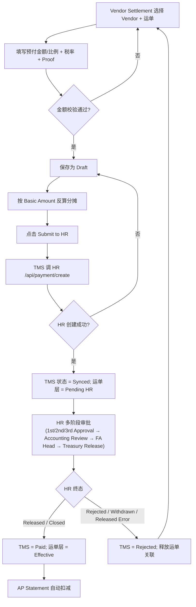
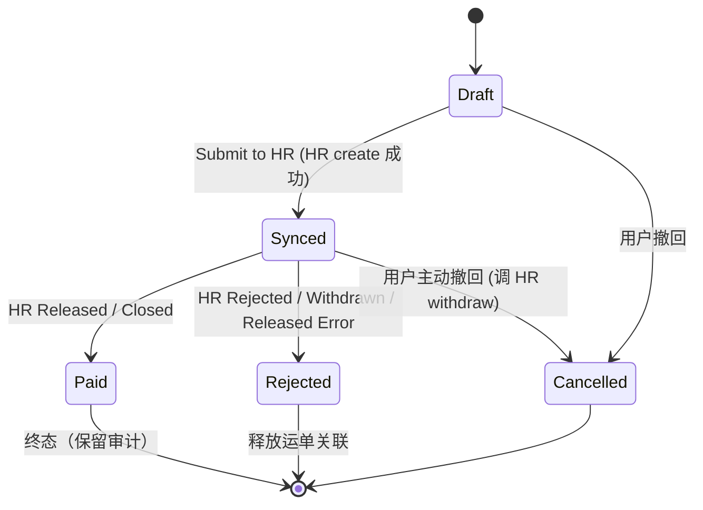
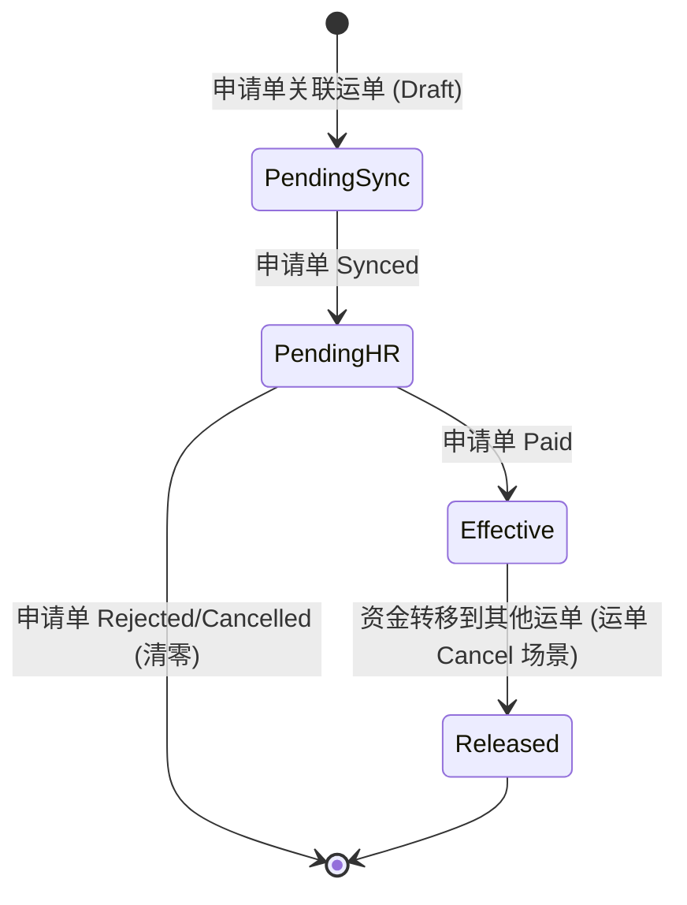

# S37 Partial Payment Application 详细设计

> 上游讨论：`src/docs/requirement/Partial Payment 流程优化讨论纪要.md`
> 关联 PRD：`Partial Payment 改造-Draft.md`、`S30 Financial Process Update.md`、`S34 对账单优化.md`、`Billing Mgmt.md`
> 关联知识库：`src/docs/knowledge_base/5_Finance_and_Billing.md`
> HR 系统取证根目录：`/Volumes/data/workspace/hr_frontend`

---

## 0. 文档信息

| 项目 | 内容 |
|------|------|
| 版本 | v1.0 |
| 状态 | Draft（待评审） |
| 关联范围 | Financial Process（新模块）、Waybill Billing、AP Statement、HR Payment Request、UAM 权限 |
| 集成方 | TMS（本系统） ↔ HR Payment（`/Volumes/data/workspace/hr_frontend`） |
| 不在范围 | 不动 Customer Statement / AR Statement；不动 Refund Ticket；不重构 Claim |

---

## 1. 背景与目标

### 1.1 现状（参 S30 §1.3 + Partial Payment 改造-Draft）

- `Paid in advance` 当前在运单 Billing 模块**单笔录入**，仅有"≤ 50% 基础运费"的弱限制，缺少凭证与外部支付状态校验。
- 实际业务：东南亚（TH/PH 为主）供应商一次提一批运单的预付，财务在 HR 系统集中支付。TMS 与 HR 数据不打通，存在重复支付、Vendor 错配、AP Statement 重复扣减等风险。
- AP Statement 当前仍把 `Paid in Advance` 作为待结算项参与运单关闭判断，导致预付款核销与对账强耦合。

### 1.2 目标

1. 以 **Partial Payment Application（预付款申请单）** 为业务主体，把"逐单预付"升格为"批量申请 + 比例分摊回写"。
2. 与 HR Payment Request 打通：TMS 提单、HR 执行、状态镜像回写 TMS 决定运单层是否生效。
3. AP Statement 解耦预付款核销，简化对账逻辑。
4. 支持 TH/PH（含未来 SG/CN/VN/MY Entity）的 VAT/WHT 差异化，与 HR 税率配置完全对齐。
5. 已预付运单 Cancel 时，强制"以单换单"完成资金转移，杜绝资金悬挂。

### 1.3 与已有 PRD 的关系

| 文档 | 本期影响 |
|------|----------|
| S30 §1.3 Billing-Paid in advance | **覆盖**：50% 限制改为 100%（含 Handling Fee），且来源限定为本期申请单写入 |
| `Partial Payment 改造-Draft.md` | **承接**：把草案中 Payment Request No. 校验、AP Statement 删除 Paid in Advance 等点正式化并补全集成细节 |
| S34 对账单优化 | **协同**：AP Statement 对 `Paid in advance` 的展示与扣减规则按本期重写 |
| `Billing Mgmt.md` | 运单 Billing 字段表新增 `Paid in advance Status` 子状态 |

---

## 2. 用户角色

| 角色 | 核心诉求 | 主要操作 |
|------|----------|----------|
| OC（Operation Coordinator / 调度员） | 在运单层准确看到已预付金额与生效状态，避免与 Vendor 沟通时口径不一 | 查看申请、查看运单 `Paid in advance` |
| Vendor Settlement（供应商结算专员） | 批量发起预付申请、关联运单、跟踪 HR 审批 | 创建 / 提交 / 取消 / 跟进申请 |
| Finance（财务） | 审批资金流、处理跨币种与税费、确认资金转移 | 审批 TMS 申请、确认资金转移 |
| HR Cashier / Treasury | 在 HR 端走完全流程审批并 Release | 在 HR 系统操作（不直接接触 TMS） |
| Vendor（供应商） | 仅查看自己的申请进度（Vendor Portal 视角） | Read-only |

---

## 3. 用户故事（Given / When / Then）

### US-01 创建预付款申请并关联运单

**As a** Vendor Settlement 专员
**I want to** 选择一个 Vendor 并勾选其下若干 Planning / Pending / In Transit 状态的运单
**So that** 我可以为这批运单一次性发起预付款申请

1. **Given** 我在 `Financial Process → Partial Payment Application`，**When** 我选择 Vendor 后，**Then** 系统加载该 Vendor 名下符合状态的运单列表，每行展示 `Waybill No / Basic Amount Payable / Currency / Status`。
2. **Given** 已勾选运单合计基础运费 = X，**When** 我选择 `Allocation Mode = Total Amount` 并录入 Y > X，**Then** 系统报错 `Total prepaid amount must be ≤ Σ Basic Amount of selected waybills.`，阻塞保存。
3. **Given** 勾选的运单存在多种 Currency，**When** 我点击保存，**Then** 系统报错 `All selected waybills must share the same currency.`，阻塞保存。

### US-02 按比例 / 总额自动分摊到运单层

**As a** Vendor Settlement 专员
**I want to** 申请单内的总金额按运单 Basic Amount 比例自动分摊回各运单
**So that** 后续对账时金额可还原到运单粒度

1. **Given** 申请单 `prepaidAmount = 10,000`，关联 3 张运单基础运费 `4,000 / 3,000 / 3,000`，**When** 申请单保存为 `Synced` 后，**Then** 系统按 `4,000 / 3,000 / 3,000` 比例写回各运单，金额分别为 `4,000 / 3,000 / 3,000`，舍入误差落在金额最大的运单上。
2. **Given** 申请单 `Allocation Mode = Percentage`，**When** 我录入 `prepaidRatio = 50%`，**Then** 各运单 `allocatedAmount = basicAmount × 50%`，回写运单 `Paid in advance` 字段；状态置为 `Pending HR`，不参与结算扣减。

### US-03 同步 HR Payment Request 并接收状态回写

**As a** Vendor Settlement 专员
**I want to** 提交申请后系统自动在 HR 创建 Payment Request 并镜像其状态
**So that** 我无需切换两个系统跟进同一笔款

1. **Given** TMS 申请单状态 `Draft`，**When** 我点击 `Submit to HR`，**Then** 系统调用 HR `POST /api/payment/create`，成功后回填 `hrPaymentId / hrPaymentNumber`，TMS 状态置 `Synced`。
2. **Given** HR 端 `paymentStatus = Released` 或 `Closed`，**When** TMS 轮询拉取，**Then** TMS 申请单置 `Paid`，关联运单的 `Paid in advance Status` 置 `Effective`，AP Statement 计算时正式扣减。
3. **Given** HR 端 `paymentStatus = Rejected / Withdrawn / Released Error`，**When** 状态同步回 TMS，**Then** 申请单置 `Rejected`，**释放**所有运单关联（运单层 `Paid in advance` 清零），允许重新发起申请。

### US-04 已预付运单 Cancel → 强制"以单换单"

**As a** Vendor Settlement 专员
**I want to** 在取消已带预付款的运单时被强制选择新运单替换
**So that** 已支付资金不会悬挂

1. **Given** Waybill A 已写入 `Paid in advance = 4,000`，**When** 我对 A 执行 Cancel，**Then** 系统弹出 `Prepayment detected. Please associate one or more new waybills to transfer the prepaid amount.`，阻塞 Cancel 直至完成关联。
2. **Given** 我选择新运单 B（Basic Amount 3,000），**When** 我点击 Confirm，**Then** 系统报错 `New waybill freight amount must be greater than or equal to the cancelled waybill (4,000).`
3. **Given** 我选择 B + C（Basic Amount 2,500 + 2,000 = 4,500 ≥ 4,000），**When** Confirm，**Then** A 的 `Paid in advance` 清零，4,000 按 `2,500 / 2,000` 比例分摊到 B / C，并写入 `transferredFrom = A`。

### US-05 AP Statement 自动剔除已预付金额

**As a** Finance
**I want to** AP Statement 自动从待结算金额中扣除已生效的预付款
**So that** 我不会重复支付且对账逻辑简化

1. **Given** 运单 Total Basic Amount = 10,000，`Paid in advance(Effective) = 6,000`，**When** 该运单进入 AP Statement，**Then** `Basic Amount Payable (Remaining) = 4,000`，明细栏新增展示 `Previously Paid (Prepaid) = 6,000`（仅展示，不参与结算项核销）。
2. **Given** 同一运单的 `Paid in advance Status = Pending HR`（HR 未 Released），**When** 进入 AP Statement，**Then** **不**扣减，`Basic Amount Payable (Remaining) = 10,000`，避免重复占用未确认款项。

---

## 4. 业务流程



**职责分界线：**

- TMS 端职责：运单选择、分摊计算、税率代入、申请单生命周期、运单层状态联动、AP Statement 扣减。
- HR 端职责：审批流（多阶段）、银行/支付定义、Treasury Release、Bank Reconciliation、Refund。
- 边界字段：HR 不感知 `waybillNo` 业务含义，TMS 把 `waybillNo` 透传到 HR `paymentItems[].referenceNumber`，便于事后反查。

---

## 5. 数据模型

### 5.1 新增实体 `PartialPaymentApplication`

| 字段 | 类型 | 必填 | 说明 |
|------|------|------|------|
| applicationNo | string | Y | TMS 主键，规则 `PPA-{country}-{yyyymmdd}-{seq}` |
| vendorId | bigint | Y | TMS Vendor ID |
| vendorName | string | Y | 冗余展示 |
| countryCode | enum | Y | `PH / TH`（与 HR `CountryEnum` 对齐；未来扩展走 Entity 维度，见 §7.4） |
| companyEntity | enum | Y | 映射 HR `PaymentsCompanyEnum`（INTELUCK / THAILAND / PTE / SHENZEHN / VIETNAM / MALAYSIA / ...） |
| currency | enum | Y | 必须与所选运单的 Currency 一致 |
| allocationMode | enum | Y | `TotalAmount / Percentage` |
| prepaidAmount | decimal(18,2) | 二选一 | `Allocation Mode = TotalAmount` 时必填 |
| prepaidRatio | decimal(5,4) | 二选一 | `Allocation Mode = Percentage` 时必填，0 < ratio ≤ 1 |
| taxInclusive | bool | Y | 决定 net/total 算法 |
| vatRate | decimal(5,4) | Y | 默认按 country+entity 代入（§7.4），允许修改 |
| whtRate | decimal(5,4) | Y | 同上 |
| netAmount | decimal(18,2) | 系统算 | 见 §6 |
| vatAmount | decimal(18,2) | 系统算 | |
| whtAmount | decimal(18,2) | 系统算 | |
| totalPayable | decimal(18,2) | 系统算 | 同步给 HR `paymentAmount` |
| documentIds | int[] | N | Proof 附件，对齐 HR `documentIds[]`（数字 ID 数组） |
| status | enum | Y | `Draft / Synced / Paid / Rejected / Cancelled` |
| hrPaymentId | bigint | N | HR 创建成功后回填 |
| hrPaymentNumber | string | N | HR `paymentNumber` 镜像 |
| hrPaymentStatus | enum | N | 镜像 HR `PaymentStatusShowEnum` |
| hrLastSyncedAt | datetime | N | 最近一次同步时间 |
| createdBy / createdAt | — | Y | 标准审计字段 |
| submittedBy / submittedAt | — | N | 提交至 HR 的人与时间 |

### 5.2 关联实体 `PartialPaymentItem`（申请单 ↔ 运单）

| 字段 | 类型 | 说明 |
|------|------|------|
| applicationNo | FK | → PartialPaymentApplication |
| waybillNo | FK | → Waybill |
| basicAmountSnapshot | decimal | 关联时的运单基础运费快照（防止 Refresh Waybill Price 后金额漂移） |
| allocatedAmount | decimal | 反算后的预付金额（不含税） |
| transferredFrom | string | 资金转移来源 `applicationNo + waybillNo`，正常申请为 NULL |
| transferredAt | datetime | 资金转移发生时间 |

> 唯一约束：同一 waybillNo 不允许被多个 **未终态**（Draft / Synced）申请单关联，防止重复占用。

### 5.3 Waybill Billing 字段调整

参考 `Billing Mgmt.md` 现有 Billing 字段表，做以下变更：

- `Paid in advance`：**保留字段**，但来源限定为 `PartialPaymentApplication` 写入，**禁止手工录入**。S30 §1.3 提及的失焦校验改为按 `Paid in advance + Handling fee ≤ 100% × Total Freight` 重新阻塞。
- 新增 `Paid in advance Status` 子状态：
  - `Pending Sync`：申请单 Draft，金额已分摊但未提交 HR；UI 上显示为虚化数字。
  - `Pending HR`：申请单 Synced，HR 未 Released；不参与 AP Statement 扣减。
  - `Effective`：申请单 Paid（HR `Released` 或 `Closed`）；正式参与 AP Statement 扣减。
  - `Released`：申请单转移至其他运单后的状态（金额已迁出，仅留审计痕迹）。

---

## 6. 计算公式与限额

```
allocatedAmount(i) = basicAmountSnapshot(i) / Σ basicAmountSnapshot × prepaidAmount    -- TotalAmount 模式
allocatedAmount(i) = basicAmountSnapshot(i) × prepaidRatio                             -- Percentage 模式

netAmount     = taxInclusive ? prepaidAmount / (1 + vatRate)         : prepaidAmount
vatAmount     = netAmount × vatRate
whtAmount     = netAmount × whtRate
totalPayable  = netAmount + vatAmount − whtAmount
```

**限额：**

| 校验点 | 公式 | 触发提示 |
|--------|------|----------|
| 申请单总额 | `prepaidAmount(net) ≤ Σ basicAmountSnapshot` | `Total prepaid amount must be ≤ Σ Basic Amount of selected waybills.` |
| 运单层（沿用 S30 + 改造） | `Paid in advance + Handling fee ≤ 100% × Total Freight` | `Paid in advance + Handling fee cannot exceed total freight.` |
| 资金转移 | `Σ new basicAmount ≥ cancelled allocatedAmount` | `New waybill freight amount must be ≥ cancelled waybill prepaid amount.` |

**舍入规则**：分摊到运单层保留 2 位小数，舍入余数（最多 ±0.01 × N）落在金额最大的那张运单上，确保 `Σ allocatedAmount = prepaidAmount` 严格成立。

---

## 7. HR 系统集成设计（核心）

> 取证文件：
> - `/Volumes/data/workspace/hr_frontend/src/api/types/payment.ts`（实体）
> - `/Volumes/data/workspace/hr_frontend/src/api/payment.ts`（接口）
> - `/Volumes/data/workspace/hr_frontend/src/enums/index.ts`（枚举）
> - `/Volumes/data/workspace/hr_frontend/src/utils/payments.ts`（税率矩阵）

### 7.1 字段映射表（TMS ↔ HR）

| TMS 字段 | HR 字段（`ICreatePaymentParams` / `IPaymentItem`） | 备注 |
|---------|----------------------------------------------------|------|
| applicationNo | （TMS 自有，存入 `paymentItems[].referenceNumber`） | HR 无对应字段，借 referenceNumber 反查 |
| vendorId | `payeeVendorId` | HR 端为 read-only 引用 |
| vendorName | `payeeName` | |
| `payeeType` | 固定 = `External Vendor`（`PayeeTypeEnum.EXTERNAL_VENDOR`） | TMS 端写死，不开放选择 |
| countryCode | `departmentCountry` | 仅 `Group / PH / TH`，其他国家走 `companyEntity` |
| companyEntity | `companyEntity` | 决定 SG/CN/VN/MY 等 Entity |
| currency | `currency` | 仅 `USD / PHP / THB / SGD / CNY`（HR 现有枚举） |
| totalPayable | `paymentAmount` | HR 端入账主金额 |
| netAmount | `paymentItems[].netAmount` | 每张运单一行 |
| vatRate / vatAmount | `paymentItems[].vatRate` / `vat` | 字段名差异：TMS `vatAmount` ↔ HR `vat`（注意映射） |
| whtRate / whtAmount | `paymentItems[].whtRate` / `wht` | 同上 |
| `paymentItems[].invoiceNumber` | 留空（TMS 在创建时无发票号） | |
| `paymentItems[].referenceNumber` | TMS 写入 `applicationNo + waybillNo` | 用于 HR 后续反查 |
| documentIds | `documentIds[]` | int 数组 |
| `paymentCategoryName` | 固定 = `Vendor Payment` | 走 `paymentCategoryId`（评审需向 HR 确认对应 ID） |
| `paymentDefinition` | 默认 = `Bank Transfer`（`PaymentDefinitionEnum.BANK_TRANSFER`） | |
| `dateOfNeeded` | 默认 = 当前日期 + 3 天 | 与 HR 财务沟通，可配置 |
| `responsibleDepartmentId` | 由 TMS 当前操作人所在部门映射 | 评审需对齐部门主数据 |
| `businessUnit` | 固定 = `Land Transportation`（`BusinessUnitEnum.LAND_TRANSPORTATION`） | TMS 当前主营 |

> ⚠️ **集成风险点**：HR `ICreatePaymentParams` 的 `waybillIds` 字段类型是 `number`（单值），不是数组。TMS 一个申请单关联多张运单时，需与 HR 后端确认：
> - 方案 A（推荐）：HR 调整字段为 `number[]`，TMS 一次申请 ↔ HR 一笔 Payment Request；
> - 方案 B：TMS 仅传"主运单 ID"，其余运单通过 `paymentItems[].referenceNumber` 反查；
> - 方案 C：TMS 拆分为多笔 HR Payment Request（最差，违背"一批支付"诉求）。
> 评审阶段需与 HR 团队确认采用方案 A。

### 7.2 HR API 调用契约

| 场景 | HR 接口 | 来源（`src/api/payment.ts`） |
|------|---------|------------------------------|
| 创建支付单 | `POST /api/payment/create` | `createPayment` |
| 净额/VAT 试算（创建前可选） | `POST /api/payment/calculate-net-amount` | `calculateNetAmountAndVat` |
| 查询支付单详情（轮询用） | `POST /api/payment/detail` | `submittedPaymentDetail` |
| 上传 Proof 附件 | `POST /api/payment/upload-supporting-document` | `uploadSupportingDocument` |
| 撤回（Withdraw） | `POST /api/payment/process/withdraw` | `paymentWithdraw` |
| 编辑（Synced 后修改） | `POST /api/payment/edit` | `paymentEdit` |

**鉴权**：沿用 HR 现有 Bearer Token + Cookie 鉴权（`getTokenKey()`），TMS 后端代理调用，前端不直连 HR。

**TMS 内部 API（新增）**：

| 路径 | 方法 | 用途 |
|------|------|------|
| `/api/partial-payment/list` | POST | 申请单列表（带筛选） |
| `/api/partial-payment/detail` | POST | 申请单详情（含分摊明细） |
| `/api/partial-payment/create` | POST | 创建草稿（仅 TMS 落库） |
| `/api/partial-payment/submit` | POST | 提交至 HR（触发 §7.2 创建支付单） |
| `/api/partial-payment/cancel` | POST | 撤回（如 HR 已 Released 则禁止） |
| `/api/partial-payment/refresh-status` | POST | 手动触发拉取 HR 状态 |
| `/api/partial-payment/transfer` | POST | 资金转移（运单 Cancel 场景） |
| `/api/waybill/{id}/available-prepayment-targets` | GET | 资金转移时可选的新运单池 |

### 7.3 状态镜像与回写

| HR `PaymentStatusShowEnum`（来源 `enums/index.ts:520-530`） | TMS 申请单 status | 运单层 `Paid in advance Status` | AP Statement 扣减 |
|----------------------------------------------------------|------------------|---------------------------------|-------------------|
| —（未提交） | Draft | Pending Sync | 不扣减 |
| Pending Approval / Pending Review / Pending FA Approval / Pending Release | Synced | Pending HR | **不扣减** |
| Released / Closed | Paid | Effective | **扣减** |
| Withdrawn / Rejected / Released Error | Rejected | （清零，记录 Released） | 不扣减 |

**同步机制**：

- 当前 HR 前端探查未发现 webhook，采取以下兜底：
  1. **定时轮询**：TMS 后台每 5 分钟轮询所有 `Synced` 状态的申请单（调 HR `/api/payment/detail`）。
  2. **手动刷新**：申请单详情页提供 `Refresh Status` 按钮，立即拉取一次。
  3. **关键节点同步**：用户主动操作（如查看 AP Statement、运单 Cancel）前先做一次拉取，避免基于过期状态决策。
- **建议**：评审时向 HR 团队提议增加 Webhook（`PaymentStatusChanged`），将轮询改为事件驱动。

### 7.4 税率默认值矩阵

> 来源：`/Volumes/data/workspace/hr_frontend/src/utils/payments.ts:48-168`，TMS 必须与 HR 配置完全对齐，**不允许重复维护**。

| Country | Entity（HR `PaymentsCompanyEnum`） | VAT 候选 | WHT 候选 |
|---------|------------------------------------|----------|----------|
| PH | INTELUCK / PRA_JIAD / MONGKHON | 0% / 12% | 0% / 1% / 2% / 5% / 10% / 12% / 15% / 25% |
| TH | THAILAND | 0% / 7% | 0% / 1% / 2% / 3% / 5% |
| Group | HOLDING | 0% | 0% |
| Group | PTE（SG） | 0% / 9% | 0% / 10% / 15% / 17% |
| Group | SHENZEHN（CN-SZ） | 0% / 1% / 3% / 6% / 9% / 10% / 13% | 0% / 3% / 10% / 20% / 25% / 30% / 35% / 45% |
| Group | CHENGDU（CN-CD） | 同 SHENZEHN（默认走 default 分支） | 同 SHENZEHN |
| Group | VIETNAM | 0% / 5% / 10% | 0% / 5% / 10% |
| Group | MALAYSIA | 0% / 5% / 6% / 10% | 0% / 10% / 15% |

**TMS 实现策略**：

- TMS 不本地维护税率表，改为在创建申请单时调 HR `getVatWhtOptionsByCountryEntity` 等价接口（评审需 HR 暴露 REST 接口；当前是前端工具方法，需后端化）。
- 用户选定 Country + Entity 后，TMS 默认带入 VAT/WHT 候选项的**最高值**（保守预扣），允许用户修改至候选范围内任意值。
- 校验：TMS 提交前再次校验 `vatRate / whtRate ∈` 候选项，防止越界。

---

## 8. 状态机

### 8.1 `PartialPaymentApplication` 状态机



### 8.2 运单层 `Paid in advance Status` 状态机



---

## 9. 异常场景：运单取消与资金转移

### 9.1 触发条件

仅当被取消的运单同时满足：
1. 该运单存在 `PartialPaymentItem` 记录；
2. 关联申请单状态 ∈ `{Synced, Paid}`（即金额已被 HR 占用或确认）。

`Draft` 状态的申请单关联运单允许直接 Cancel，由 TMS 释放即可。

### 9.2 UI 拦截

弹窗 `Transfer Prepayment` 必填项：

| 字段 | 来源 | 校验 |
|------|------|------|
| 待替换运单池 | `/api/waybill/{id}/available-prepayment-targets`（同 Vendor、同 Currency、状态 ∈ Planning/Pending/In Transit、未被其他活跃申请单占用） | 必选 ≥ 1 |
| 校验金额 | 系统计算 `Σ new basicAmount` | `≥ cancelled allocatedAmount` |
| 操作备注 | 文本 | 必填，记入审计 |

### 9.3 重分配算法

```
Let A = cancelled allocatedAmount
Let newWaybills[] sorted by basicAmount desc
For each i:
  newAllocated[i] = basicAmount[i] / Σ basicAmount × A
  round to 2 decimal
舍入余数落在 newAllocated[0]，确保 Σ = A
```

### 9.4 审计字段

`PartialPaymentItem.transferredFrom = "{originalApplicationNo}/{cancelledWaybillNo}"`
`PartialPaymentItem.transferredAt = now()`
同步插入审计日志：`xxx transferred prepaid amount {A} from {oldWaybill} to {newWaybills} (reason: {reason})`。

### 9.5 限制

- **默认仅允许一次转移**：`transferredFrom != NULL` 的 `PartialPaymentItem` 关联的运单再次 Cancel 时，强制走 Finance 人工审批，不允许在 UI 自助二次转移。
- HR 端 `paymentNumber` 不变（HR 不感知 TMS 的运单替换，仅 TMS 内部账面调整）。

---

## 10. AP Statement 解耦

### 10.1 字段调整

| 位置 | 当前 | 调整后 |
|------|------|--------|
| AP Statement 详情明细行 | 含 `Paid in advance` 待结算列 | **删除**该列 |
| AP Statement 详情明细行 | — | **新增** `Previously Paid (Prepaid)` 展示列（非结算项，仅展示已生效预付款） |
| AP Statement 导出 Excel | 含 `Paid in Advance` 列 | 同步删除 |
| AP Statement 结算项核销 | `Paid in advance` 参与运单 `Settled / Closed` 判断 | **不再参与** |

### 10.2 计算变更

```
Basic Amount Payable (Remaining) = Total Basic Amount − Σ allocatedAmount(Effective)
```

仅 `Paid in advance Status = Effective` 的金额参与扣减，避免与 HR 未确认款项重复。

### 10.3 受影响 PRD

需在评审时同步告知 / 修订：S30、S34、`Customer Statement.md`（仅声明 AR 不受影响）、`Billing Mgmt.md`（字段表新增子状态）。

---

## 11. 权限模型（UAM）

| 操作 | OC | Vendor Settlement | Finance | HR Cashier | Vendor |
|------|----|-------------------|---------|------------|--------|
| 查看申请列表 / 详情 | Y（仅本部门） | Y（全 Vendor） | Y | N | 仅自己 |
| 创建申请（Draft） | N | Y | Y | N | N |
| 编辑 Draft | N | Y（创建人 / 同部门） | Y | N | N |
| 提交至 HR（`Submit to HR`） | N | Y | Y | N | N |
| 撤回（Cancel） | N | Y（仅 Draft / Synced） | Y | N | N |
| 资金转移确认 | N | N | **Y（Finance 独有）** | N | N |
| 二次资金转移审批 | N | N | **Y** | N | N |
| 查看 HR 同步日志 | N | Y | Y | N | N |

> 权限点新增：`partial_payment.view / create / edit / submit / cancel / transfer / transfer.review`，纳入 UAM 树。

---

## 12. 验收清单（Definition of Done）

### 12.1 业务规则

- [ ] 总额超出运单基础运费之和时报错并阻塞提交（`Σ basicAmount` 校验）。
- [ ] 多 Currency 运单不允许混入同一申请单。
- [ ] 分摊金额之和严格等于申请单总额（含舍入余数处理）。
- [ ] HR 状态 ∉ `{Released, Closed}` 时，运单层 `Paid in advance` 不参与 AP Statement 扣减。
- [ ] HR 状态变为 `Rejected / Withdrawn / Released Error` 时自动释放运单关联，金额清零。
- [ ] 已预付运单 Cancel 时强制弹出 `Transfer Prepayment` 弹窗，金额校验通过前不允许 Cancel。
- [ ] 同一运单不能同时被两个未终态申请单占用（唯一约束）。
- [ ] AP Statement 列表 / 详情 / 导出均无 `Paid in Advance` 待结算列；新增 `Previously Paid (Prepaid)` 展示列。

### 12.2 HR 集成

- [ ] HR `/api/payment/create` 失败时，TMS 申请单保持 `Draft`，错误信息回显，可重试。
- [ ] 字段映射 100% 覆盖（依据 §7.1 表）；`vat ↔ vatAmount`、`wht ↔ whtAmount` 字段名差异有显式映射代码。
- [ ] HR 状态轮询失败 ≥ 3 次连续失败时，UI 显示"同步异常"红色提示，不影响其他申请单。
- [ ] 跨币种场景：HR `currency` 与 TMS 运单 `currency` 不一致时报错阻塞，不允许提交。
- [ ] 税率候选项与 HR `getVatWhtOptionsByCountryEntity` 当日返回值完全一致（自动化集成测试）。
- [ ] `paymentItems[].referenceNumber` 包含 `applicationNo + waybillNo`，HR 端可反查。

### 12.3 权限与审计

- [ ] 所有创建 / 提交 / 撤回 / 转移操作记录至 Operation Log。
- [ ] 资金转移记录含 `from waybill / to waybills / amount / operator / reason / timestamp`。
- [ ] OC 角色不能创建 / 提交 / 撤回 / 转移，仅可读。

---

## 13. 待确认事项 & Open Issues

| # | 议题 | 决策路径 |
|---|------|----------|
| 1 | HR `ICreatePaymentParams.waybillIds` 是否调整为数组 `number[]` | 与 HR 后端对齐；本期默认走"方案 A"（见 §7.1）|
| 2 | HR 是否能提供 Webhook 推送状态变更 | 与 HR 团队对齐；未实现前走轮询 + 手动刷新 |
| 3 | 资金二次 / 多次转移的 Finance 审批流（界面 + 节点） | 评审会议讨论，本期最低实现"二次直接拒绝/只允许 Finance 后台操作" |
| 4 | `paymentCategoryId = Vendor Payment` 在 HR 实际数值 | 需 HR 提供 ID（前端仅展示 categoryName） |
| 5 | `responsibleDepartmentId` 与 `dateOfNeeded` 默认值规则 | 与 HR 财务沟通，TMS 是否走配置项 |
| 6 | HR `Currency` 枚举仅 `USD / PHP / THB / SGD / CNY`，缺 MYR / VND | 上线前确认 HR 是否补齐；本期 Vendor Currency 范围内若出现 MYR/VND 需阻塞并提示 |
| 7 | 已发起申请单后，运单 `Refresh Waybill Price` 触发的金额漂移 | 用 `basicAmountSnapshot` 锁定；申请单创建后该字段不再随 RL 变动 |

---

## 14. 关联资料

**TMS 内部：**
- `src/docs/requirement/Partial Payment 流程优化讨论纪要.md`
- `src/docs/prds/Partial Payment 改造-Draft.md`
- `src/docs/prds/S30 Financial Process Update.md`
- `src/docs/prds/S34 对账单优化.md`
- `src/docs/prds/Billing Mgmt.md`
- `src/docs/knowledge_base/5_Finance_and_Billing.md`

**HR 系统取证：**
- `/Volumes/data/workspace/hr_frontend/src/api/types/payment.ts`（实体 `ICreatePaymentParams` / `IPaymentItem` / `ISubmittedPaymentDetail`）
- `/Volumes/data/workspace/hr_frontend/src/api/payment.ts`（接口契约）
- `/Volumes/data/workspace/hr_frontend/src/enums/index.ts`（`PaymentStatusShowEnum:520-530`、`PayeeTypeEnum:681`、`PaymentDefinitionEnum:631`、`CurrencyEnum:651`、`CountryEnum:326`、`PaymentsCompanyEnum`）
- `/Volumes/data/workspace/hr_frontend/src/utils/payments.ts`（税率矩阵 `getVatWhtOptionsByCountryEntity:48-168`）
- `/Volumes/data/workspace/hr_frontend/AGENT.md`（架构约束）
