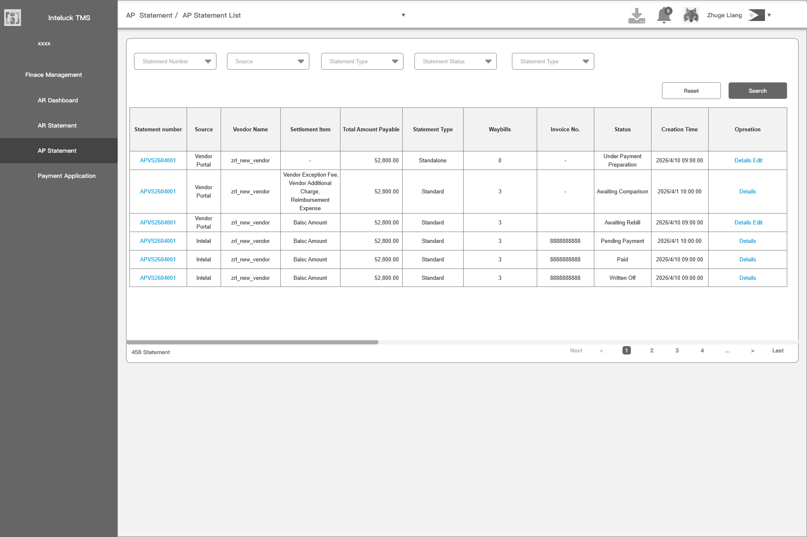
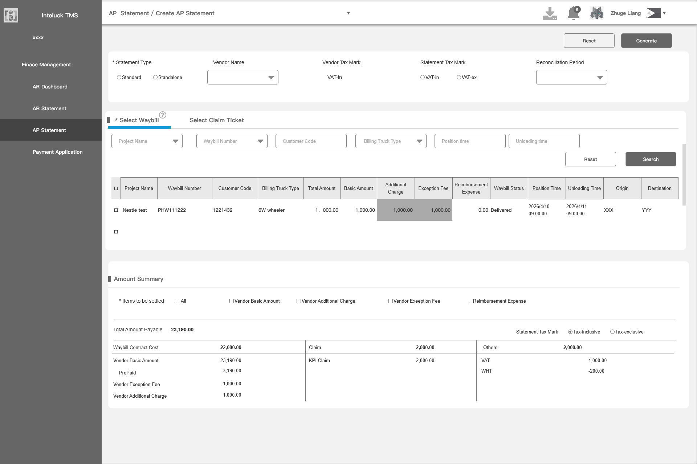
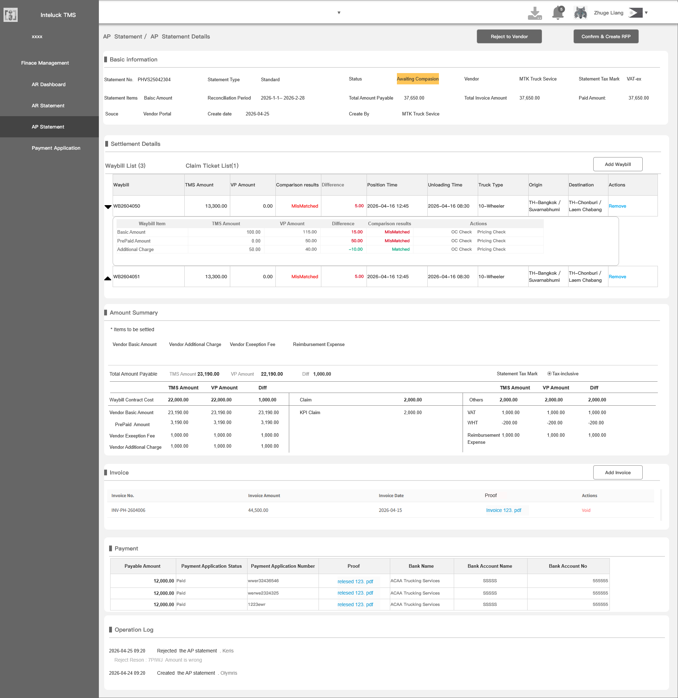
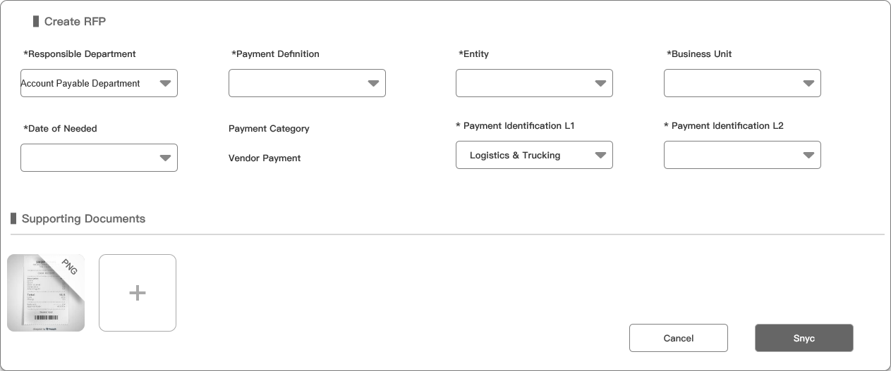
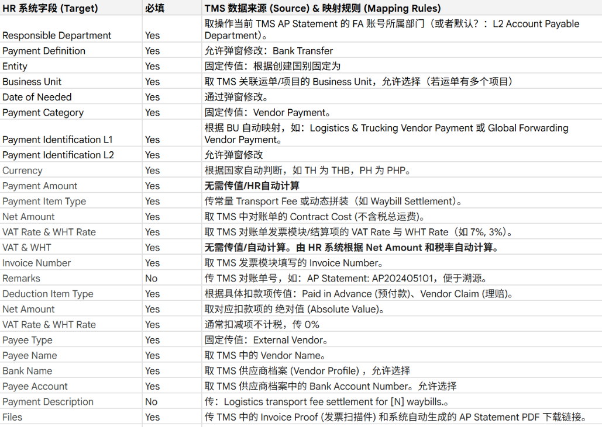
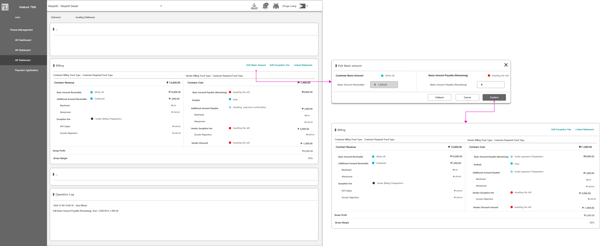
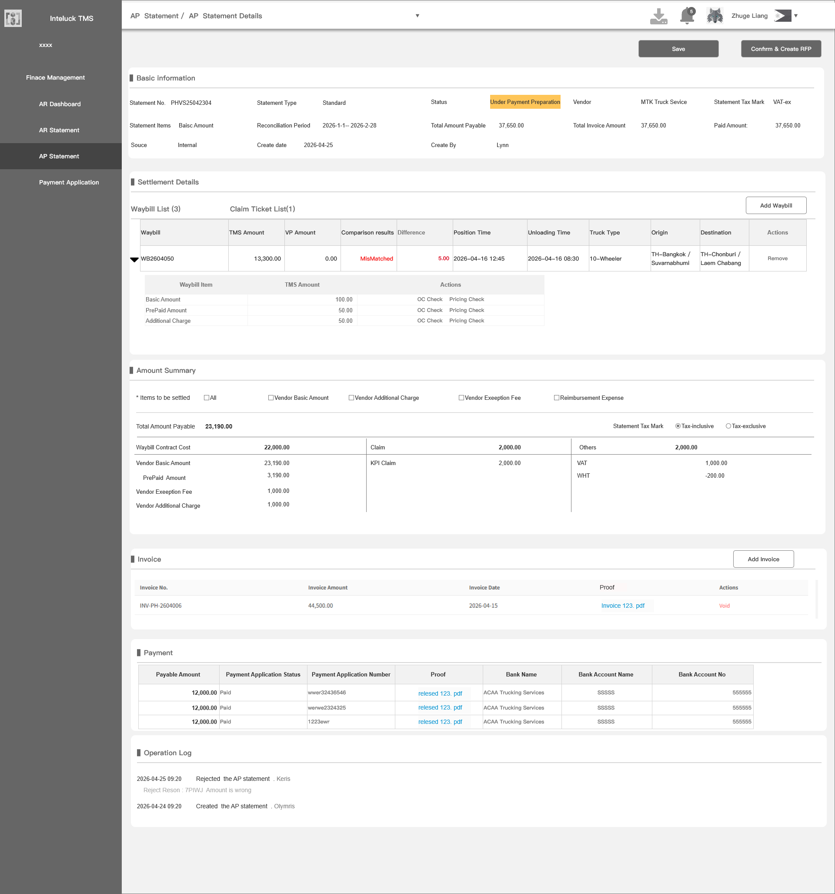

TMS 端AP Statement List 页，展示TMS端与VP端创建的所有 AP Statement 

TMS端 创建AP Statement 页，其中 Select Waybill页中的结算项 若在 item TO BE settled 中未选择，则对应列置灰，已被其他AP Statement 关联的结算项也做相关置灰或其他标识

TMS 端 Awaiting Compasion 状态的 AP statement 详情页。允许添加/ remove 运单，允许对运单的特定结算项进行状态标识，仅所有结算项均为matched,才能confirm & Create RFP
该状态为VP端创建的AP Statement 待在TMS 端比较价格
若结算项不均为matched,则展示提示信息，Payment Blocked: Associated Item [XX] is not matched. Please check the item Comparison results ，否则confirm & Create RFP 禁用
若满足结算项均为matched,则confirm & Create RFP 启用，点击后展示创建RFP的弹窗 ：如image-5.png （并参考image-6.png 中字段信息展示其他支付信息）
若需在运单中修改被拒结算项，参考下图image-7.png的运单--billing 信息中修改

TMS 端 Under Payment Preparation状态的 AP statement 详情页
